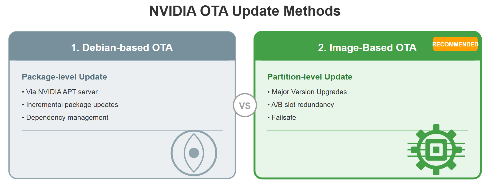
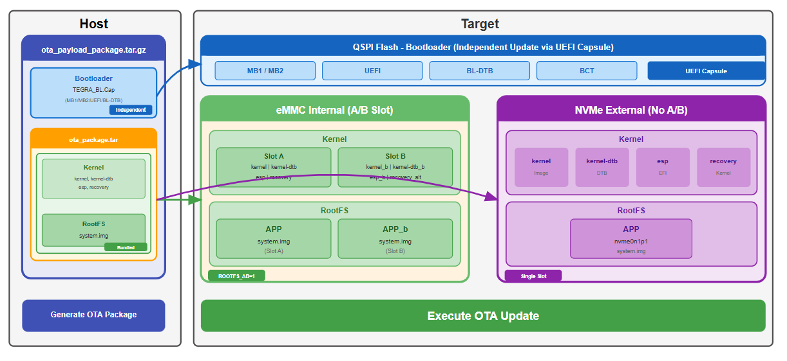
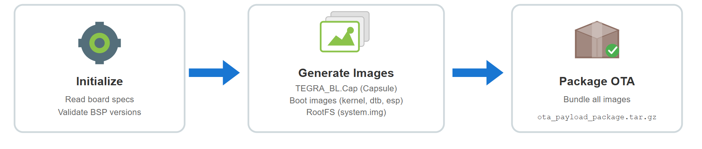
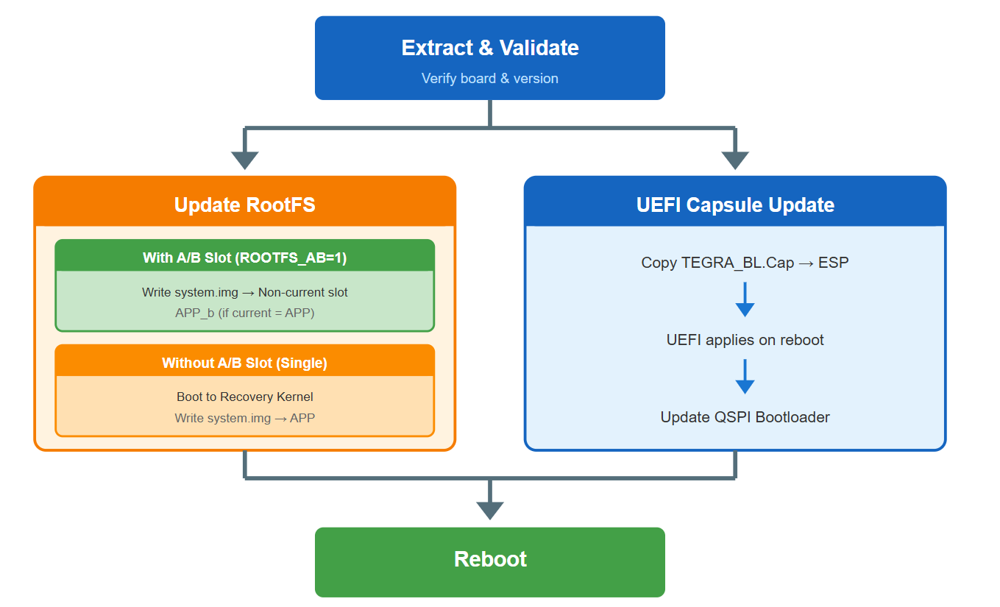
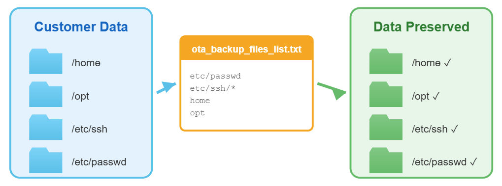
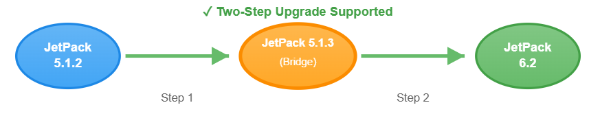
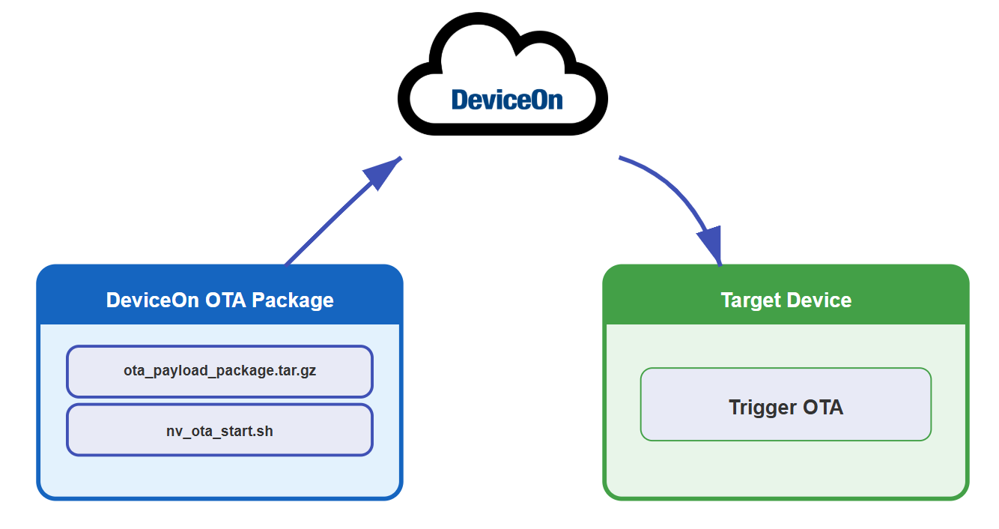
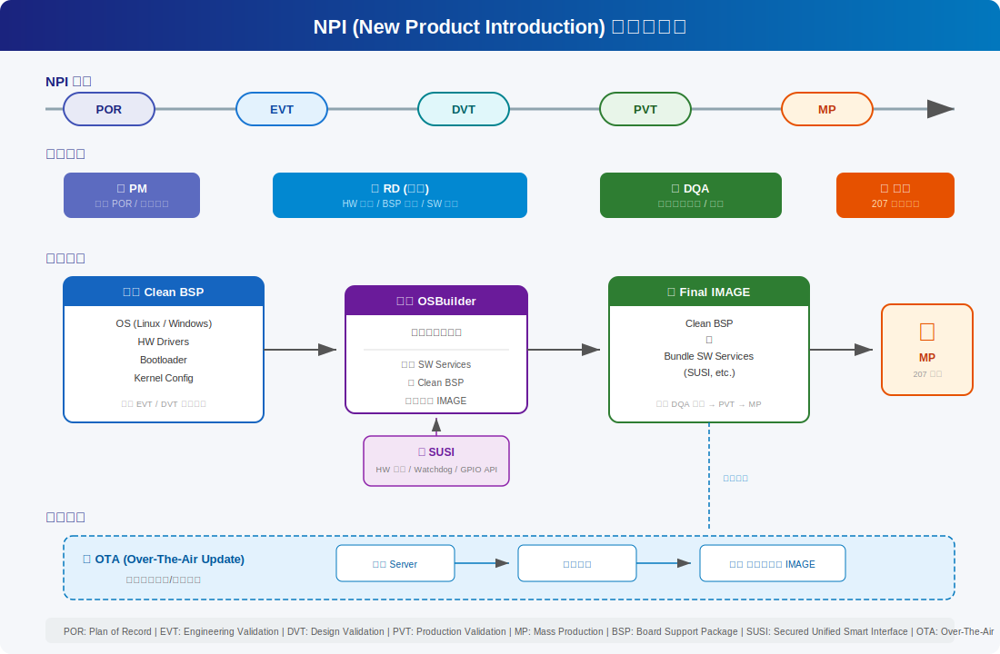

# EBC-RC04 JetPack OTA

> **2026/3/2 — Dennis**

---

## Outline

- [What is NVIDIA OTA](#what-is-nvidia-ota)
- [What is Image-Based OTA](#what-is-image-based-ota)
- [Generate OTA Package](#generate-ota-package)
- [Execute OTA Update](#execute-ota-update)
- [Backup Mechanism](#backup-mechanism)
- [Customer Scenario on EBC-RC04](#customer-scenario-on-ebc-rc04)
- [Integrate DeviceOn OTA](#integrate-deviceon-ota)
- [Document Reference](#document-reference)

---

## What is NVIDIA OTA

---

## What is Image-Based OTA

---

## Generate OTA Package

Constructing the OTA payload on Host : **l4t_generate_ota_package.sh**

---

## Execute OTA Update

Safely apply the update via **nv_ota_start.sh**

---

## Backup Mechanism

The **ota_backup_files_list.txt** file should be configured to preserve customer data during the OTA update process.

---

## Customer Scenario on EBC-RC04

Direct OTA upgrade from Jetpack 5.1.2 to 6.2 is **NOT** supported.

We use Jetpack 5.1.3 (Standard BSP) as an intermediate bridge.

---

## Integrate DeviceOn OTA

---

## Document Reference

- <https://ess-kms.edgecenter.io/en/wiseec/public/Nvidia/EBC_RC04_OTA>
- <https://ess-kms.edgecenter.io/en/wiseec/internal/Nvidia/OTA_Package_Flow>

---

## NPI Architecture

> 以下為 NPI (New Product Introduction) 架構流程圖，來源為 `npi-architecture.svg`。

### NPI 階段

| 階段 | 說明 |
|------|------|
| POR  | Plan of Record |
| EVT  | Engineering Validation Test |
| DVT  | Design Validation Test |
| PVT  | Production Validation Test |
| MP   | Mass Production |

### 角色分工

| 角色 | 職責 |
|------|------|
| 📋 PM | 定義 POR / 規劃需求 |
| 🔧 RD (研發) | HW 開發 / BSP 建構 / SW 整合 |
| ✅ DQA | 設計品質驗證 / 測試 |
| 🏭 工廠 | 量產製造 |

### 核心架構

| 組件 | 內容 | 用途 |
|------|------|------|
| 🖥️ Clean BSP | OS (Linux / Windows)、HW Drivers、Bootloader、Kernel Config | 用於 EVT / DVT 硬體驗證 |
| ⚙️ OSBuilder | 自動化打包工具，整合 SW Services，整合進 Clean BSP，產出完整 IMAGE | 打包工具 |
| 📦 SUSI | HW 監控 / Watchdog / GPIO API | 硬體抽象層 |
| 💿 Final IMAGE | Clean BSP ＋ Bundle SW Services (SUSI, etc.) | 用於 DQA 測試 → PVT → MP |

---

> *Go Together, We Go Far and Grow Big*
